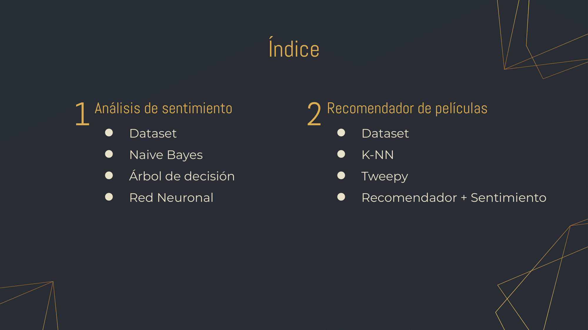
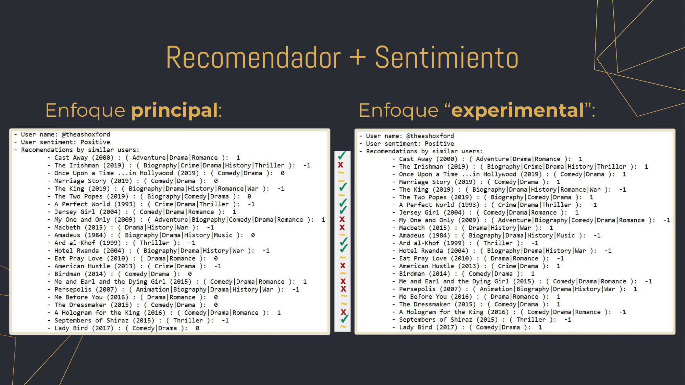

# Proyecto Mineria de Datos y Big Data: 2020-2021
#### Ela Katherine Shepherd Arévalo - Pablo Daurell Marina

- Presentación del proyecto

- Notebooks con código + explicaciones:
	- NaiveBayes y Arbol de decisión (1), Red Neuronal (2), Recomendador de películas (3)
	- (también en formato pdf por si los notebooks diesen problemas)

- Carpeta data:
	- Dataset sentiment140
	- Dataset MovieTweetings + user_genres.csv generado en el notebook 3
	- tweet-sentiment-NN -> Red neuronal (tensorflow) entrenada
	- tweet-vectorizeLayer -> Capa de TextVectorizer ya entrenada

